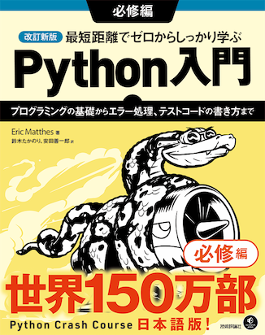
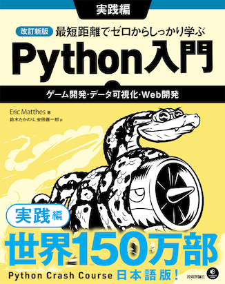

# 改訂新版 最短距離でゼロからしっかり学ぶPython入門

書籍「改訂新版 最短距離でゼロからしっかり学ぶPython入門」の「必修編」「実践編」のサンプルコード、演習問題のコード例が置いてあります。

## 改訂新版 最短距離でゼロからしっかり学ぶPython入門 必修編

〜プログラミングの基礎からエラー処理、テストコードの書き方まで

* https://gihyo.jp/book/2024/978-4-297-14528-6
* 2024年10月31日発売
* Eric Matthes著，鈴木たかのり，安田善一郎 翻訳
* サイズ: B5変形判
* ページ数: 312ページ
* 定価: 3,300円＋税
* ISBN: 978-4-297-14528-6

### 目次

* 第1章 はじめの一歩
* 第2章 変数とシンプルなデータ型
* 第3章 リスト入門
* 第4章 リストを操作する
* 第5章 if文
* 第6章 辞書
* 第7章 ユーザー入力とwhileループ
* 第8章 関数
* 第9章 クラス
* 第10章 ファイルと例外
* 第11章 コードをテストする
* 付録
  * 付録A Pythonのインストールとトラブルシュート
  * 付録B テキストエディターとIDE
  * 付録C 助けを借りる

## 改訂新版 最短距離でゼロからしっかり学ぶPython入門 実践編

〜ゲーム開発・データ可視化・Web開発

* https://gihyo.jp/book/2024/978-4-297-14526-2
* 2024年10月31日発売
* Eric Matthes著，鈴木たかのり，安田善一郎 翻訳
* サイズ: B5変形判
* ページ数: 360ページ
* 定価: 3,500円＋税
* ISBN: 978-4-297-14526-2

### 目次

* プロジェクト1 エイリアン
  * 第1章: 弾を発射する宇宙船
  * 第2章: エイリアン！
  * 第3章: 得点を表示する
* プロジェクト2 データの可視化
  * 第4章: データを生成する
  * 第5章: データをダウンロードする
  * 第6章: APIを取り扱う
* プロジェクト3 Webアプリケーション
  * 第7章: Djangoをはじめる
  * 第8章: ユーザーアカウント
  * 第9章: アプリケーションのスタイル設定とデプロイ
* 付録
  * 付録A バージョン管理にGitを使う
  * 付録B デプロイのトラブルシューティング
  * 付録C Matplotlibに日本語フォントを設定する
