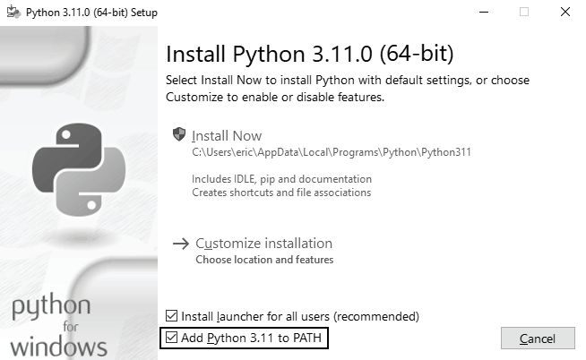

# Windows上インストール手順

Windowsには通常はPythonが付属していないので、Pythonのインストールが必要です。
そのあとでVS Codeをインストールします。

## Pythonをインストールする

はじめに、PCにPythonがインストールされているかを確認します。
スタートメニューに「command」と入力し、**コマンドプロンプト** アプリをクリックします。
コマンドプロンプトのターミナル画面に `python` と小文字で入力します。
Pythonプロンプト（`>>>`）が表示されたら、PCにはPythonがインストールされています。
``python`` というコマンドが認識できないという意味のエラーメッセージが表示された、またはMiscrosoft Storeが開いた場合は、Pythonがインストールされていません。
Microsoft Storeが開いた場合は閉じます。Microsoftのバージョンよりも公式インストーラーのPythonをダウンロードすることをおすすめします。

Pythonがインストールされていないか、Pythonのバージョンが3.9より古い場合は、Windows用のPythonインストーラーをダウンロードします。
https://python.org を開き、「Downloads」リンクの上にマウスカーソルを移動します。
最新バージョンのPythonのダウンロード用ボタンが表示されます。
ボタンをクリックすると、OSに対応したインストーラーのダウンロードが始まります。
ファイルのダウンロードが終了したら、インストーラーを起動します。
［Add Python to PATH］オプションを選択してインストールすることにより、システムに正しくパスが設定されます。
*図1-1* は、このオプションを選択した状態の画面です。



## Pythonをターミナル上で動かす

ターミナル画面を開いて小文字で ``python`` と入力します。
Pythonプロンプト（``>>>``）が表示されます。
これは、先ほどインストールしたPythonをWindowsが見つけたことを意味します。

```bash
C:\> python
Python 3.x.x (main, Jun . . . , 13:29:14) [MSC v.1932 64 bit (AMD64)] on win32
"help", "copyright", "credits" or "license" for more information.
>>>
```

## VS Codeをインストールする

VS Codeのインストーラーは、Webサイト（https://code.visualstudio.com ）からダウンロードできます。
［Download for Windows］ボタンをクリックし、インストーラーを実行します。
